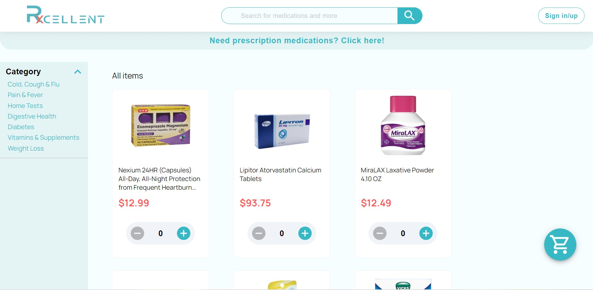
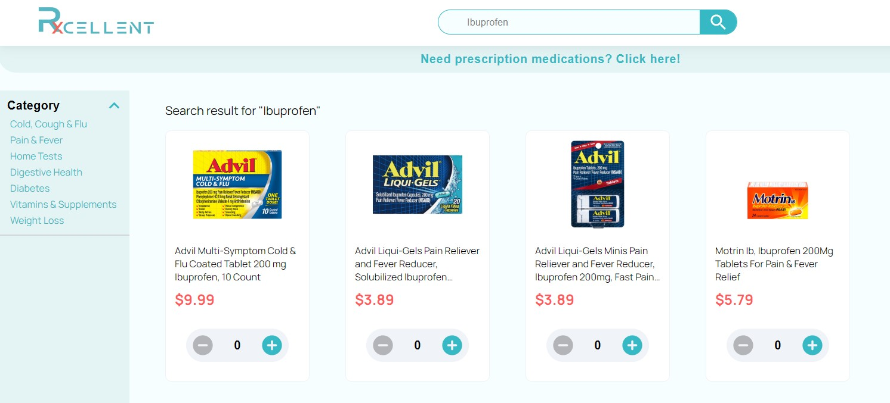
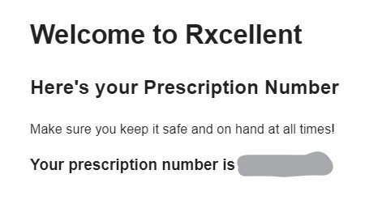
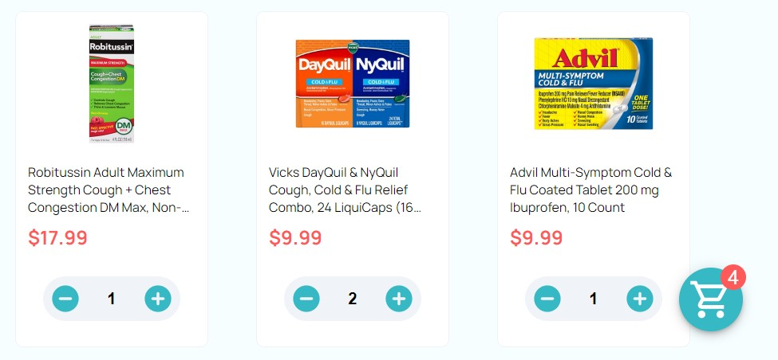
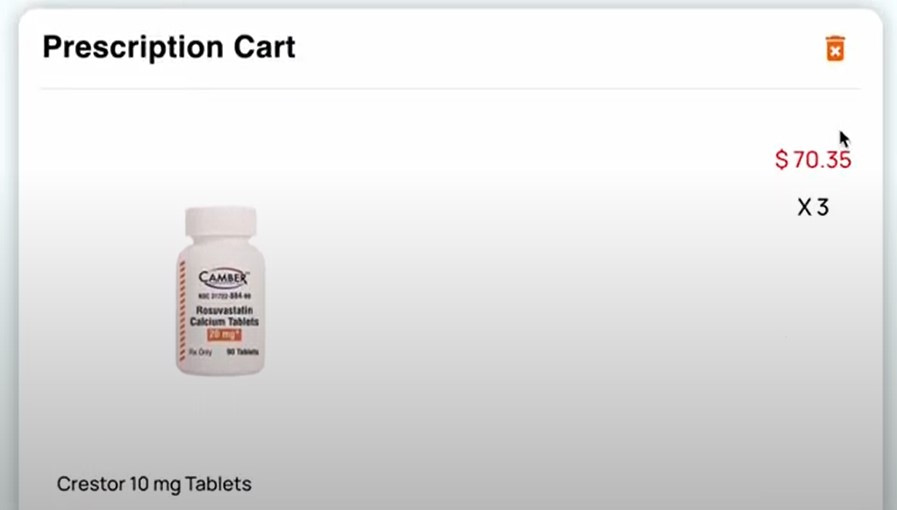
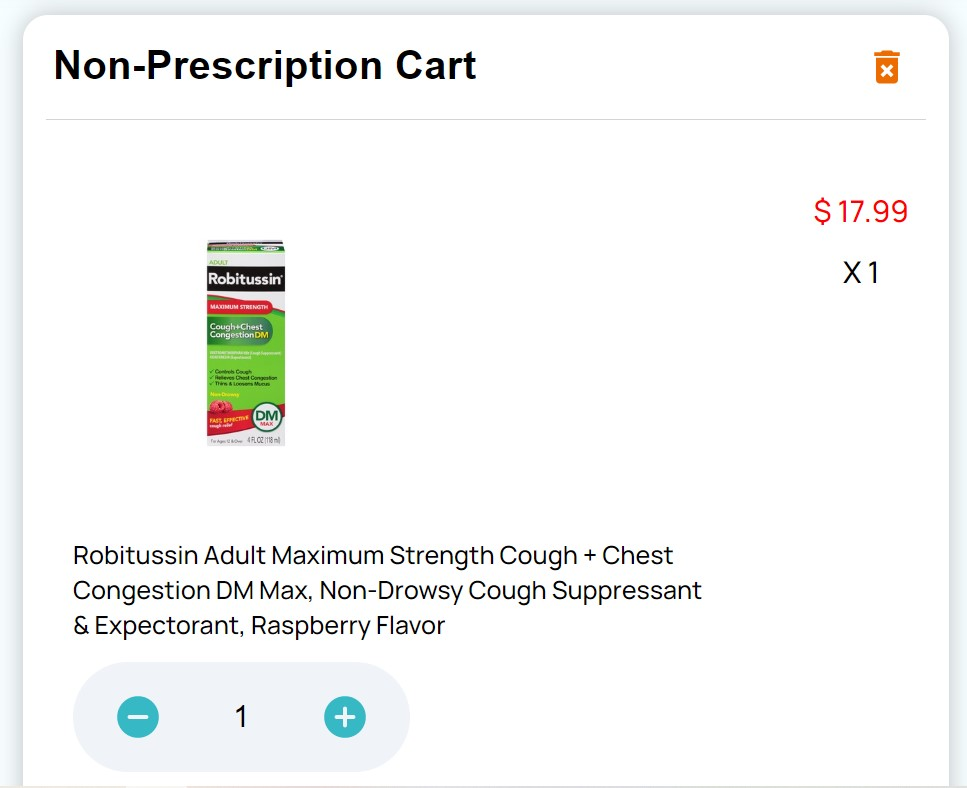

    
     

# Rxcellent

Team 4 set out to build a pharmacy e-commerce application where a user could receive and refill their prescriptions without the need to log in and have the option to shop for other items commonly found in a pharmacy.

## Technology Stack

Rxcellent is a full-stack JavaScript project.

-   Frontend:
    -   HTML, CSS, JavaScript
    -   [React](https://reactjs.org/) as the main UI framework
    -   [Vite](https://vitejs.dev/guide/) as build engine and front-end server
    -   [TypeScript](https://www.typescriptlang.org/) for type safety upon JS
    -   [MUI](https://mui.com/) for UI components
    -   [React-Redux](https://react-redux.js.org/), [React-Query](https://react-query-v3.tanstack.com/), [React-Router](https://reactrouter.com/en/main), [Axios](https://axios-http.com/docs/intro)
    -   [ESLint](https://eslint.org/) and [Prettier](https://prettier.io/) for code formatting
    -   [Husky](https://typicode.github.io/husky/#/) as Git hooks tool
    -   [Vitest](https://vitest.dev/) as test automation tool with [React Testing Library](https://testing-library.com/docs/react-testing-library/intro/)

 

-   Backend:
    -   [Node.js](https://nodejs.org/en/) as JavaScript runtime
    -   A template build upon [Express.js](https://expressjs.com/) as Node.js framework
    -   [Mongoose.js](https://mongoosejs.com/) as MongoDB client
    -   [Bcrypt](https://www.npmjs.com/package/bcrypt), [JsonWebToken](https://www.npmjs.com/package/jsonwebtoken), [NodeMailer](https://nodemailer.com/about/)
    -   [ESLint](https://eslint.org/) and [Prettier](https://prettier.io/) for code formatting
    -   [Husky](https://typicode.github.io/husky/#/) as Git hooks tool
    -   [Vitest](https://vitest.dev/) as test automation tool with [supertest](https://www.npmjs.com/package/supertest) and [mongodb-memory-server](https://www.npmjs.com/package/mongodb-memory-server)

 

## A list of Completed Features

-   Main Page
    -   The main page works as a hub for the rest of the software. It offers a variety of options for the user to follow.
-   Medicines Page
    -   This page allows users to visualize all the medicines offered at our website. It also allows users to visualize price and be able to sort them by categories.
        
-   Search Bar
    -   This Search Bar feature allows users to search a specific medicine. It will display on the Medicines Page, and allows for searching base on the name of the medicine.
        
-   Doctor Log In and Prescription Creation
    -   One of the main features of our website includes automatic prescription creation and verification. With this functionality, all the doctors we have registered on our system will be able to log in and generate prescriptions for their clients.
        
        
-   Prescription Email
    -   Once the doctor generates a prescription, it will automatically send an email to the patient email provided in the prescription creation. This email will contain the prescription number that the patients must save so they can use the site.
        
-   Prescription-Based Log In
    -   Users only need their Prescription Number and their Date of Birth. They will input those into the appropriate field, and the system will recognize the patients, and automatically add their prescription medicines to the Shopping Cart
        
-   Shopping Cart
    -   Users are able to add medicines that they are interested in buying to the Shopping Cart. This feature will keep track of all the medicines added, including the ones in their prescriptions.
        
-   Separate Prices
    -   In the checkout page in the Shopping Cart, users can see what will be their total cost, and be able to see the cost for all their Prescription and Non-Prescription based medicines.
        
        

 

## Development Configuration Instructions

### Start the project

-   (If you haven't already cloned the repo) `git clone https://github.com/BUMETCS673/group-project-team4-js.git`

-   To install all dependencies, run `$ sh build.sh` in project root directory, <b style='font-size:18px'>or</b>

    -   (In project root directory) `npm install`
    -   (In project "be" directory) `npm install`
    -   (In project "fe" directory) `npm install`

 

-   (In project "be" directory) `npm run start` to run backend server
-   (In project "fe" directory) `npm run dev` to run frontend server
-   Go to url -> `localhost:5673`

 
